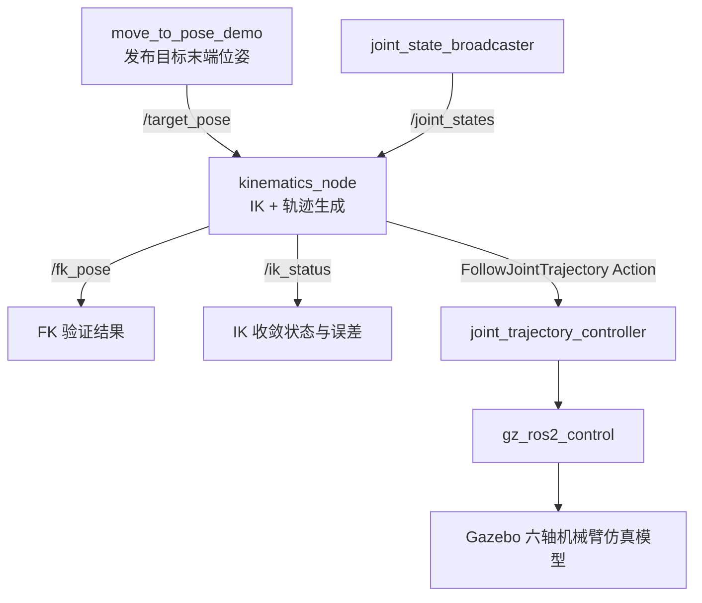

# ROS 2 Jazzy + Gazebo 六自由度机械臂运动学仿真课程报告

## 1. 项目背景与任务目标

本课程作业基于教材《机器人理论与技术基础》第 3 章中的机器人运动学思想，并参考
`mhuasong/Basics-of-Robotics-Theory-and-Technology` 仓库中 `ch3/kinematics`
的参数和算法组织方式，完成一个可运行的六自由度机械臂仿真项目。

项目的目标不是只让机械臂“动起来”，而是把机器人运动学中的几个核心概念串成一个完整闭环：

1. 建立六自由度机械臂几何模型。
2. 使用齐次变换矩阵描述各关节之间的相对位姿。
3. 根据关节角计算末端执行器位姿，即正运动学。
4. 根据目标末端位姿求解关节角，即逆运动学。
5. 将逆运动学结果转换为关节轨迹，并通过 `ros2_control` 驱动 Gazebo 中的仿真机械臂。
6. 使用正运动学再次验证逆解误差，形成“目标位姿 -> IK -> 轨迹控制 -> FK 验证”的闭环。

项目运行环境为 Ubuntu 24.04、ROS 2 Jazzy、现代 Gazebo 和 `ros_gz` 生态。代码组织为
ROS 2 workspace，主要包含三个包：

| ROS 2 包 | 作用 |
| --- | --- |
| `robot_arm_description` | 定义机械臂 Xacro/URDF 模型、连杆、关节、惯性、碰撞体、可视化和 `ros2_control` 接口。 |
| `robot_arm_kinematics` | 使用 C++ 和 Eigen 实现正运动学、逆运动学、轨迹插值和 ROS 2 运动学节点。 |
| `robot_arm_bringup` | 提供 Gazebo world、控制器参数和统一启动文件。 |

## 2. 系统总体方案

本项目采用“模型层、算法层、控制层、仿真层”分层设计。这样做的好处是：模型定义、运动学算法和仿真启动互不混杂，便于调试和解释。



运行时的数据流如下：

1. `move_to_pose_demo` 先给出一组预设关节角，并通过正运动学计算出可达目标位姿。
2. 目标位姿发布到 `/target_pose`。
3. `kinematics_node` 订阅 `/target_pose` 和 `/joint_states`，以当前关节角作为 IK 初值。
4. IK 收敛后，节点发布 `/ik_status`，并把 IK 结果再做一次 FK，发布到 `/fk_pose`。
5. 节点生成五次多项式关节轨迹，通过 `/joint_trajectory_controller/follow_joint_trajectory` action 发送给控制器。
6. Gazebo 中的机械臂执行轨迹，`joint_state_broadcaster` 持续反馈关节状态。

这种设计体现了机器人控制系统中常见的闭环思想：理论算法不是孤立计算，而是要和状态反馈、控制器、仿真环境连接起来。

## 3. 机械臂建模原理

### 3.1 连杆、关节与坐标系

机械臂本质上是由多个刚体连杆和关节串联形成的开链机构。每个关节会引入一个自由度，六自由度机械臂通常可以同时控制末端的位置和姿态。

本项目的六个主动关节命名为 `joint_1` 到 `joint_6`，末端工具坐标系命名为 `tool0`。模型中的关键参数来自教材示例机械臂：

| 参数 | 数值 | 含义 |
| --- | ---: | --- |
| `d1` | `0.0985 m` | 基座到第一关节高度方向偏移。 |
| `a2` | `-0.408 m` | 第二段主臂长度，负号表示沿局部负 X 方向。 |
| `a3` | `-0.376 m` | 第三段主臂长度，负号同样表示沿局部负 X 方向。 |
| `d4` | `0.1215 m` | 腕部横向偏移。 |
| `d5` | `0.1025 m` | 腕部到末端附近的竖向偏移。 |
| `d6` | `0.094 m` | 工具末端偏移。 |

URDF/Xacro 中的关节轴定义如下：

| 关节 | 旋转轴 | 功能理解 |
| --- | --- | --- |
| `joint_1` | `Z` | 基座偏航，改变机械臂朝向。 |
| `joint_2` | `-Y` | 肩部俯仰，抬起或放下主臂。 |
| `joint_3` | `-Y` | 肘部俯仰，改变前臂姿态。 |
| `joint_4` | `-Y` | 腕部俯仰。 |
| `joint_5` | `-Z` | 腕部偏航。 |
| `joint_6` | `-Y` | 工具端俯仰。 |

这里最重要的原则是：**URDF 中的 joint origin 和 joint axis 必须与 C++ 正运动学中的变换链完全一致**。如果仿真模型和数学模型使用不同坐标系，那么 IK 算出的关节角即使数学上正确，也无法让 Gazebo 中的 `tool0` 到达预期位置。

### 3.2 为什么使用简化几何模型

项目中的连杆使用 cylinder 和 sphere 等基本几何体，而没有使用复杂工业机械臂 mesh。这样选择有三个原因：

1. 课程重点是运动学原理，不是工业外观建模。
2. 简化几何体更容易观察关节轴、连杆长度和坐标系关系。
3. Gazebo 启动和碰撞计算更轻量，适合课程演示和调试。

因此，本项目的模型目标是“几何和运动学关系正确”，而不是外观完全复刻某一款真实机械臂。

## 4. DH 与 MDH 建模方法对比

### 4.1 标准 DH 方法

Denavit-Hartenberg 方法用四个参数描述相邻连杆坐标系之间的关系：

| 参数 | 含义 |
| --- | --- |
| `a_i` | 连杆长度，沿 `x_i` 方向的距离。 |
| `alpha_i` | 连杆扭角，绕 `x_i` 的旋转。 |
| `d_i` | 连杆偏距，沿 `z` 方向的距离。 |
| `theta_i` | 关节角，绕 `z` 方向的旋转。 |

标准 DH 常见的单节变换顺序可以理解为：

```text
RotZ(theta_i) -> TransZ(d_i) -> TransX(a_i) -> RotX(alpha_i)
```

它的优点是形式统一、教材和资料丰富，适合推导传统串联机械臂的解析运动学。但是在工程实现中，标准 DH 的坐标系经常放在“当前关节之后”的位置，和 URDF 中 joint origin 表达方式不总是直观对应。

### 4.2 改进 DH 方法

改进 DH，也常写作 MDH，调整了坐标系附着方式和变换顺序。常见的 MDH 单节变换可写为：

```text
TransX(a_{i-1}) -> RotX(alpha_{i-1}) -> TransZ(d_i) -> RotZ(theta_i)
```

相比标准 DH，MDH 更强调“从上一连杆坐标系出发，到当前关节处再旋转”的局部关系。它在机械臂建模、URDF 对齐和多关节链调试中通常更直观。

### 4.3 标准 DH 与 MDH 的差异

| 对比项 | 标准 DH | 改进 DH / MDH |
| --- | --- | --- |
| 坐标系附着习惯 | 更偏向当前连杆之后的统一公式。 | 更偏向上一连杆到当前关节的局部关系。 |
| 变换顺序 | 先绕 `Z` 转动，再沿 `Z` 平移，再处理 `X` 方向。 | 先处理上一连杆的 `X` 方向关系，再处理当前关节变量。 |
| 教学推导 | 经典、资料多。 | 对工程实现和 URDF 对齐更直观。 |
| 与 URDF 的对应 | 需要额外小心 joint origin 与 DH frame 的对应。 | 更容易映射到逐关节的 origin 和 axis。 |
| 适用场景 | 解析推导、教材公式展示。 | 仿真建模、工程调试、ROS 机械臂链路实现。 |

### 4.4 本项目为什么选择等效 MDH 变换链

本项目没有机械地照搬标准 DH 表格，而是使用了“与 MDH 思想一致的逐关节局部变换链”。原因如下：

1. **便于和 URDF 对齐**
   URDF 的核心表达是每个 joint 的 `origin` 和 `axis`。这天然就是“从父连杆到子连杆”的局部变换。等效 MDH 链同样按局部父子关系组织，更容易保证数学模型和仿真模型一致。

2. **便于 Gazebo 验证**
   Gazebo 中真正运动的是 URDF 关节。如果正运动学使用另一套不一致的坐标系，即使 FK/IK 在矩阵公式中自洽，也可能和仿真结果不一致。本项目选择让 `kinematics.cpp::forward()` 的每一步都对应 Xacro 中的关节原点和关节轴。

3. **适合课程作业解释**
   标准 DH 和 MDH 的核心价值都是将复杂空间机构拆成一串相邻坐标系变换。本项目通过等效 MDH 形式展示这个思想，同时保留了和 ROS 工程实现直接对应的可解释性。

4. **为数值 IK 提供稳定基础**
   本项目使用数值 IK。数值 IK 不强依赖某一种 DH 表格形式，但强依赖 FK 的准确性。只要 FK 与 URDF 完全一致，Jacobian 和误差迭代就有稳定的物理意义。

因此，本项目的选择可以概括为：**理论上继承 DH/MDH 的坐标变换思想，工程上采用和 URDF 一致的逐关节局部变换链。**

## 5. 正运动学原理

正运动学解决的问题是：已知六个关节角 `q = [q1, q2, q3, q4, q5, q6]`，求末端执行器 `tool0` 相对于 `base_link` 的位置和姿态。

空间刚体位姿可用 4x4 齐次变换矩阵表示：

```text
T = [ R  p ]
    [ 0  1 ]
```

其中：

- `R` 是 3x3 旋转矩阵，描述末端姿态。
- `p` 是 3x1 平移向量，描述末端位置。
- 最后一行 `[0 0 0 1]` 用于把旋转和平移统一到矩阵乘法中。

本项目的 FK 变换链与 Xacro 模型保持一致：

| 步骤 | 变换 | 物理意义 |
| --- | --- | --- |
| 1 | `Trans(0, 0, d1) * RotZ(q1)` | 从基座到第一关节，并绕 Z 轴旋转。 |
| 2 | `Rot(-Y, q2)` | 肩关节俯仰。 |
| 3 | `Trans(a2, 0, 0) * Rot(-Y, q3)` | 沿主臂到肘关节，并进行肘部旋转。 |
| 4 | `Trans(a3, 0, 0) * Rot(-Y, q4)` | 沿前臂到腕部，并进行腕部俯仰。 |
| 5 | `Trans(0, -d4, 0) * Rot(-Z, q5)` | 腕部偏移和腕部偏航。 |
| 6 | `Trans(0, d4, -d5) * Rot(-Y, q6)` | 腕部局部补偿和工具端俯仰。 |
| 7 | `Trans(0, -(d4+d6), 0)` | 从第六关节到 `tool0`。 |

整体末端位姿为：

```text
T_base_tool0 = T1 * T2 * T3 * T4 * T5 * T6 * T_tool
```

这对应代码中的 `SixAxisArmKinematics::forward()`。每一项平移和旋转都可以在
`six_axis_arm.urdf.xacro` 中找到对应的 joint origin 或 joint axis。

正运动学在项目中有三个作用：

1. 在 `fk_ik_test` 中验证给定关节角的末端位姿。
2. 在 `move_to_pose_demo` 中把预设关节角转换为可达目标位姿，避免随便给一个不可达目标。
3. 在 IK 求解后再次计算 `fk_pose`，用来检查逆解误差。

## 6. 逆运动学原理

逆运动学解决的问题是：已知目标末端位姿 `T_target`，求一组关节角 `q`，使得：

```text
FK(q) ≈ T_target
```

逆运动学通常比正运动学困难，原因有三点：

1. 可能无解：目标位姿超出机械臂工作空间。
2. 可能多解：同一个末端位姿可能对应肘上、肘下等多种构型。
3. 可能不稳定：在奇异位形附近，小的末端变化会导致很大的关节角变化。

### 6.1 解析 IK 与数值 IK 对比

| 方法 | 优点 | 缺点 |
| --- | --- | --- |
| 解析 IK | 速度快，能明确列出多组解，适合结构规则的工业机械臂。 | 推导复杂，对机械臂结构依赖强；坐标系或末端工具稍改就要重新推导。 |
| 数值 IK | 通用性强，适合任意 URDF 链；容易加入关节限位和误差指标。 | 需要迭代，可能不收敛；速度通常慢于解析解。 |

原教材仓库中包含解析法、几何法、Jacobian 迭代等多种思路。考虑到本项目需要和 ROS/Gazebo 的 URDF 模型完全对齐，并且课程重点是展示完整仿真闭环，因此实现中选择数值 IK 作为主方法。

### 6.2 为什么使用阻尼最小二乘法

本项目使用阻尼最小二乘法，也称 Damped Least Squares。它的基本思想是：通过 Jacobian 建立末端误差和关节增量之间的线性近似关系：

```text
e ≈ J * Δq
```

其中：

- `e` 是 6 维位姿误差，前三维为位置误差，后三维为姿态误差。
- `J` 是 6x6 Jacobian 矩阵。
- `Δq` 是每次迭代要更新的关节角增量。

普通伪逆法在奇异位形附近容易出现数值放大。阻尼最小二乘法加入阻尼项：

```text
Δq = -J^T * (J * J^T + λ^2 I)^(-1) * e
```

这里的 `λ` 是阻尼系数。本项目中 `kDamping = 0.08`。阻尼项的作用类似“刹车”：当 Jacobian 接近奇异时，避免关节角增量突然变得很大。

选择阻尼最小二乘法的原因是：

1. **奇异位形附近更稳定**
   六自由度机械臂常见腕部奇异和肘部伸直奇异，阻尼项可以减小数值爆炸风险。

2. **与 URDF 模型兼容性好**
   只要 FK 能正确计算末端位姿，数值 IK 就可以工作，不需要重新推导复杂解析公式。

3. **便于解释和调试**
   迭代次数、位置误差、姿态误差、阻尼系数、步长限制都能直接输出和分析。

4. **适合仿真闭环**
   Gazebo 演示更看重可达目标的稳定执行，而不是追求工业控制器级别的毫秒级解析解速度。

## 7. Jacobian 与误差定义

### 7.1 位姿误差

IK 迭代需要先定义“当前末端位姿”和“目标末端位姿”之间的误差。

位置误差直接使用目标位置和当前 FK 位置之差：

```text
e_p = p_target - p_current
```

姿态误差使用旋转矩阵列向量叉乘的半和：

```text
e_R = 0.5 * (R_current_x × R_target_x
           + R_current_y × R_target_y
           + R_current_z × R_target_z)
```

最终形成 6 维误差向量：

```text
e = [ e_p ]
    [ e_R ]
```

代码中 `poseError()` 负责计算这个 6 维误差；`orientationErrorNorm()` 则使用相对旋转矩阵的迹反算姿态角误差，便于输出“多少弧度/多少度”的收敛指标。

### 7.2 有限差分 Jacobian

Jacobian 描述关节角微小变化对末端位姿误差的影响。严格推导解析 Jacobian 需要逐节坐标系和旋转轴公式。本项目采用有限差分法：

```text
J[:, i] = (error(q + h_i) - error(q)) / h
```

其中 `h = 1e-5`。这样做的优点是实现简单，并且天然与当前 FK 函数保持一致。只要 FK 和 URDF 对齐，有限差分 Jacobian 就和仿真模型对应。

有限差分法的代价是每次迭代需要多次调用 FK，因此速度不如解析 Jacobian。但对课程作业中的六自由度模型和 50 点轨迹演示来说，这个代价可以接受。

### 7.3 关节限位、多初值与步长限制

为了提高 IK 的稳定性，项目中还加入了三类保护机制：

| 机制 | 作用 |
| --- | --- |
| 关节限位 | 每次更新后把关节角限制在 URDF 关节范围内，避免生成仿真无法执行的角度。 |
| 多初值策略 | 分别从当前关节角、零位、肘上构型、肘下构型开始迭代，选择误差最小的解。 |
| 单步最大增量 | 限制每次关节变化不超过 `0.18 rad`，避免一次迭代跨越过大导致发散。 |

收敛标准为：

| 指标 | 阈值 |
| --- | ---: |
| 位置误差 | `< 0.005 m` |
| 姿态误差 | `< 3 deg` |
| 最大迭代次数 | `250` |

## 8. 轨迹规划原理

IK 得到的是目标关节角，但控制器不能只接收“瞬间跳到目标”的命令。机械臂需要一条随时间变化的平滑轨迹。

本项目使用五次多项式插值：

```text
s(t) = 10t^3 - 15t^4 + 6t^5,  t ∈ [0, 1]
q(t) = q_start + s(t) * (q_goal - q_start)
```

这个函数满足：

```text
s(0) = 0
s(1) = 1
s'(0) = 0
s'(1) = 0
s''(0) = 0
s''(1) = 0
```

因此它可以实现平滑起步和平滑停止，避免关节速度突变。项目中 `quinticTrajectory()` 生成 50 个轨迹点，`kinematics_node` 将这些点写入 `trajectory_msgs/msg/JointTrajectoryPoint`，再通过 `FollowJointTrajectory` action 发送给 `joint_trajectory_controller`。

这一步体现了运动学和控制器之间的衔接：IK 只负责求目标关节角，轨迹规划负责把目标角变成可执行的时间序列。

## 9. ROS 2 / Gazebo 闭环实现

### 9.1 主要 ROS 接口

| 接口 | 类型 | 作用 |
| --- | --- | --- |
| `/target_pose` | `geometry_msgs/msg/PoseStamped` | 目标末端位姿输入。 |
| `/joint_states` | `sensor_msgs/msg/JointState` | 当前关节状态反馈。 |
| `/fk_pose` | `geometry_msgs/msg/PoseStamped` | IK 结果经 FK 验证后的末端位姿。 |
| `/ik_status` | `std_msgs/msg/String` | IK 是否收敛、关节角、误差和迭代次数。 |
| `/joint_trajectory_controller/follow_joint_trajectory` | `control_msgs/action/FollowJointTrajectory` | 发送关节轨迹到控制器。 |

### 9.2 `ros2_control` 的作用

Gazebo 本身负责物理仿真，`ros2_control` 负责把 ROS 控制器和仿真中的关节连接起来。本项目中：

1. Xacro 文件声明每个关节具有 `position` command interface。
2. `gz_ros2_control` 插件把 Gazebo 关节包装成 ROS 2 control hardware。
3. `joint_state_broadcaster` 发布关节状态。
4. `joint_trajectory_controller` 接收轨迹 action，并向仿真关节发送位置命令。

因此，`kinematics_node` 并不直接控制 Gazebo 物理对象，而是通过标准 ROS 2 action 与控制器交互。这种方式更符合 ROS 2 机器人系统的工程结构。

## 10. 实验设计与验证方法

### 10.1 FK/IK 控制台测试

运行：

```bash
ros2 run robot_arm_kinematics fk_ik_test
```

测试内容：

1. 对 `[0, pi/2, 0, pi/2, 0, 0]` 执行 FK，并输出 4x4 末端位姿矩阵。
2. 对一组预设关节角执行 `FK -> IK -> FK` 闭环验证。
3. 检查最终位置误差是否小于 `5 mm`，姿态误差是否小于 `3 deg`。

### 10.2 Gazebo 仿真测试

启动仿真：

```bash
ros2 launch robot_arm_bringup sim.launch.py
```

启动目标位姿演示：

```bash
ros2 run robot_arm_kinematics move_to_pose_demo
```

预期现象：

1. Gazebo 中出现六自由度机械臂。
2. 控制器启动后，机械臂每 8 秒接收一个新目标。
3. `/ik_status` 输出 `IK converged`、关节角、位置误差、姿态误差和迭代次数。
4. `/joint_states` 持续变化，说明控制器正在驱动仿真关节。

### 10.3 建议截图

课程报告中建议加入以下截图：

1. Gazebo 中的初始机械臂模型。
2. RViz 中的 TF 树或 RobotModel。
3. `fk_ik_test` 的终端输出。
4. `/ik_status` 的终端输出。
5. 机械臂执行目标轨迹前后的对比图。

## 11. 项目总结

本项目完成了一个从理论到仿真的六自由度机械臂运动学闭环。建模方面，项目没有简单停留在外观建模，而是强调 URDF/Xacro 中的关节原点和关节轴必须与 C++ 正运动学中的变换链一致。运动学方面，项目以 DH/MDH 的坐标变换思想为基础，采用与 URDF 更容易对齐的等效 MDH 局部变换链。逆运动学方面，项目选择阻尼最小二乘数值法，牺牲一部分解析解速度，换取更好的通用性、稳定性和仿真适配性。

最终，系统通过 `ros2_control` 和 Gazebo 把目标位姿、逆运动学、轨迹规划、关节控制和状态反馈连接起来。这个过程体现了机器人课程中非常重要的一点：运动学公式只有落到模型、控制器和仿真闭环中，才能真正验证其工程意义。
